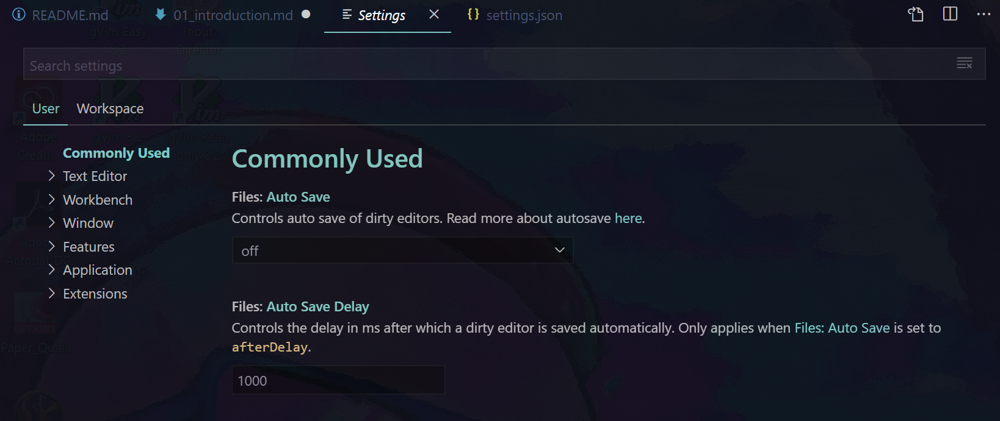
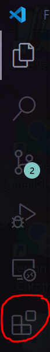

# Introduction

Visual studio code (often fondly abbreviated to VSCode) is a free open-source code editor developed by Microsoft. It is highly customizable with a vast array of powerful extensions giving it the complete power of a Integrated Development Environment (IDE). In this document we log quality of life tips and tricks made by the current user to act both as a log, but also as a useful tool to new users. For more in-depth information the main website already contains a highly detailed [introduction](https://code.visualstudio.com/docs).

## Installation

VSCode can be downloaded directly from [here](https://code.visualstudio.com/).

## Settings

Settings in visual studio code can be opened via the dropdown menu, File->Preferences->Settings, or via the following shortcut `Ctrl+,`. Settings can be opened within two modes, either in UI mode,

## Extensions

VSCode [extensions](https://code.visualstudio.com/docs/editor/extension-gallery) can be installed from the marketplace tab,

